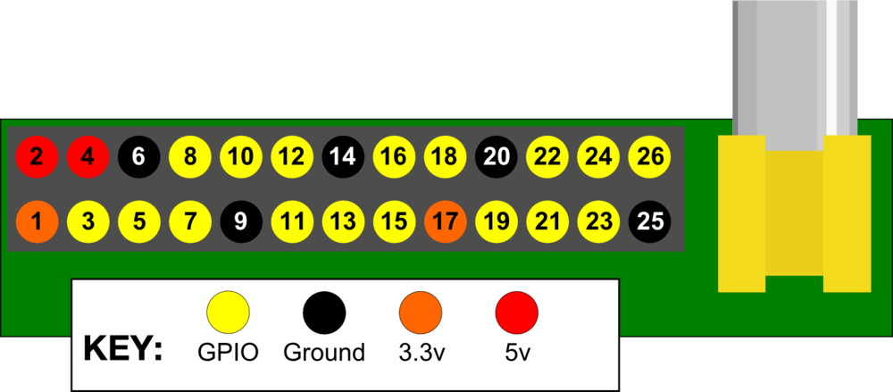

## demo notes

ssh into the Raspberry π and start the receiver and transmitter in a 'screen':

    cd hardware
    screen -c screenrc
    
To switch between the tabs press Control-z then the tab number.

To 'detach' from the screen press Control-z then d.

To reattach to the screen, run `screen -r`.

## Specific hardware and costs

See the [spreadsheet](https://docs.google.com/spreadsheets/d/1aLX0yPriqRYv9exc7hV8ZaoWDZZKsPV997NUnLpyvPM/edit?usp=sharing).

## XBee-DigiMesh

Unlike XBee Zigbee, it supports synchronized sleeping, for low-power meshing.

The [chip](http://www.digikey.com/product-detail/en/XB24-DMPIT-250/602-1338-ND/3482610) — this is the same hardware as [XBee Series 1](http://www.digikey.com/product-detail/en/XB24-API-001/602-1273-ND/3482588) but with DigiMesh firmware pre-installed.

The [docs](http://ftp1.digi.com/support/documentation/90000991_L.pdf).

Adding a new node is slightly trickier, but if the π node is in "Synchronous Sleep Support Mode" SM=7, then you can just bring a new node near the π at any time and it will sync up with the rest of the sleeping (SM=8) nodes.

TODO - how to cause an I/O sample every time nodes wake up? Possibly large nonzero IR value will trigger just one initial read?

TODO - use EE=1 on all nodes, to enable encryption?

### Power Consumption

The input range of the MCP1700 is about 3.5V to absolute maximum 6.5V,
so we use 4xAAA batteries, which gives us an initial voltage of about 6.4V, and a voltage of about 4V after 1000mAh.

- MCP1700 quiescent current < 4µA
- XBee cyclic sleep current < 50µA
- Xbee transmit current < 45mA
- XBee idle/receive current < 50mA
- XBee ADC current **??**
- MCP9700 operating current < 12µA

**TODO** measure these!
- total sleeping current < 54µA
- total waking current < 100mA

So if we transmit for 5 seconds every hour, we use 193µAh per hour, so 4x1000mAh battery would last 2.4 years.

And if we transmit for 20 seconds every hour, we use 610µAh per hour, so 4x1000mAh battery would last 0.7 years.

### hub node

**firmware** = DigiMesh

**ID** = unique to this hub _i.e. unique to this building / sensor network_

**NI** = "hub" _TODO potentially lets us set the destination of all sensors easily with the DN command?_

**AP** = 1

### sensor node

**firmware** = DigiMesh

**ID** = same as coordinator

(default) **DH/DL** = 0/FFFF _which broadcasts readings_ TODO how to send just to hub?

**D1** = 2 _to set AD1 as analog read_

**IR** = e.g. 3E8 for 1 second, EA60 for 1 minute. TODO max is FFFF (66 seconds); how to do hourly? probably using sleep?

### alternatives

#### XBee-Zigbee

Can't both sleep and mesh, but has a better ADC, perhaps among other things.

Make sure to connect VREF to VCC. This is basically undocumented, but without it the chip basically crashes after a minute of reading from the ADC. _TODO_ email Digi about this.

The [chip](http://www.digikey.com/product-detail/en/XB24-Z7PIT-004/602-1275-ND/3482624), aka XBee Series 2.

The [docs](http://ftp1.digi.com/support/documentation/90000976_S.pdf)

## Raspberry π notes

### overview

connect XBee to the π via serial GPIO pins

listen for IO frames, which are of the form 0x7E....92

use a (manually maintained) mapping of 64-bit sensor addresses to apartments, to record apartment temperatures

### serial connection

connect XBee to GPIO serial pins directly

- GPIO pin 1 (3v3) to XBee pin 1 (VCC)
- GPIO pin 6 (GND) to XBee pin 10 (GND)
- GPIO pin 8 (TXD) to XBee pin 3 (DIN)
- GPIO pin 10 (RXD) to XBee pin 2 (DOUT)

disable console output to serial with `sudo raspi-config` > Advanced Options > Serial > Off

device is /dev/ttyAMA0

then standard python `serial` library can be used

### linux setup

    sudo raspi-config
    # 1, 2, 4 > Locale, then reboot
    # then the rest of 4, and 8 > Hostname and 8 > Serial > Off
    sudo apt-get update && sudo apt-get upgrade
    sudo apt-get install emacs23-nox screen usb-modeswitch wvdial
    sudo wvdialconf
    sudo emacs /etc/wvdial.conf
    # Phone = *99#
    # Password = None
    # Username = None
    # Stupid Mode = 1
    # Init3 = AT+CGDCONT=1,”IP”,”epc.tmobile.com”

### Data usage

Assuming each reading is ~100 bytes (the reading itself may be as little as 20-30 bytes, plus the HTTP headers), and each cell takes 24 readings per day, that's 24 x 100 = 2,400 bytes per day per cell, or 2.4 kilobytes (roughly, 1kb = 1024b).

Assuming a base is connected to 10 cells, then the base will be transmitting 10 x 2.4 = 24 kilobytes per day.
Assuming 31 days per month (worst case), and 365 days per year, data usage will be:

|numCells|Data/Day|Data/Month|Data/120d|Data/Year|
|--------|--------|----------|---------|---------|
|1       |2.4 kb  |0.0744 mb |0.288 mb |0.876 mb |
|10      |24 kb   |0.744 mb  |2.88 mb  |8.76 mb  |
|15      |36 kb   |1.17 mb   |4.32 mb  |13.14 mb |
|20      |48 kb   |1.48 mb   |5.76 mb  |17.52 mb |
|30      |72 kb   |2.23 mb   |8.64 mb  |26.28 mb |
|50      |120 kb  |3.72 mb   |14.4 mb  |43.8 mb  |
|100     |240 kb  |7.44 mb   |28.8 mb  |87.6 mb  |

Pre-paid Vodafone SIM cards:
- [1MB/month for a year](http://www.embeddedworks.net/wsim2730.html) for $31.27, or $2.61/MB
- [5MB/month for 6 months](http://www.embeddedworks.net/wsim2737.html) for $46.11, or $1.54/MB
- [10MB/month for a year](http://www.embeddedworks.net/wsim2786.html) for $137.41, or $1.15/MB

### 3G modems

There's a [generic stick](http://www.amazon.com/Generic-Wireless-7-2Mbps-Dongle-Function/dp/B00MHAKIJY/ref=sr_1_10?ie=UTF8&qid=1410451158&sr=8-10&keywords=usb+modem+wireless) for ~$13 and a [branded alternative](http://www.amazon.com/Huawei-E173-Unlocked-HSDPA-7-2Mbps/dp/B0055310KQ) for ~$26. Given that we currently budget $6 for a USB WiFi dongle, each of these represents some increase to the cost of the base, $7 and $20, respectively.

[Verified 3G USB dongles](http://elinux.org/RPi_VerifiedPeripherals#USB_3G_Dongles)

### alternatives

connect the HSDPA (3G) dongle to an [Arduino USB Host Shield](https://www.sparkfun.com/products/9947), to see how easy direct USB 3G modem AT commands are... possibly not easy.

connect a [FONA GSM (2G) board](https://www.adafruit.com/fona) to an Arduino or whatever. this isn't cheaper than a Raspberry Pi, but could lead to a cheaper PCB.
